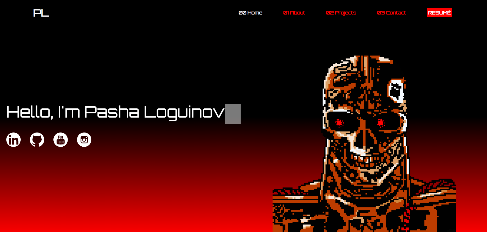

# React Personal Web Developer Portfolio Website

## Description: 

This is a responsive React single-page application that I desgined to display my top projects from my portfolio. The theme is inspired by the [Terminator](https://en.wikipedia.org/wiki/The_Terminator) franchise and is illustrated with custom pixel art I created using [Adobe Photoshop](https://www.youtube.com/watch?v=9OfeNDukXm8).

This project was bootstrapped with [Create React App](https://github.com/facebook/create-react-app). 

## Tools Used: 

* [Typescript](https://www.typescriptlang.org/docs/)
* [React.js](https://reactjs.org/)
* [Tailwind.css](https://tailwindcss.com/docs/installation)
* [React Hook Form](https://react-hook-form.com/get-started/)
* [Framer Motion](https://www.framer.com/motion/introduction/)
* [Adobe Photoshop](https://www.adobe.com/products/photoshop.html)

## Installation
After cloning the repository, install all dependencies by executing `npm install` within the top level project directory. To run this application in developer mode run:

### `npm run start`